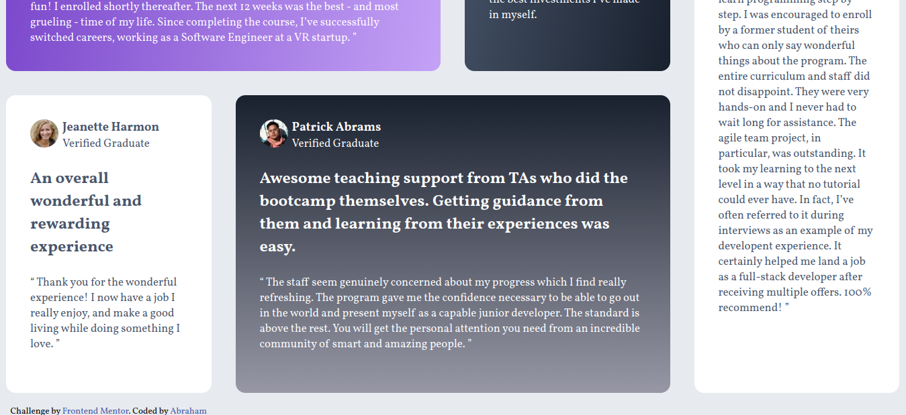

# Testimonials Grid Section 💬

Solución al reto [testimonials-grid-section](https://www.frontendmentor.io/challenges/testimonials-grid-section-Nnw6J7Un7) de Frontend Mentor.

## 🔗 Links

- 🌐 Demo en vivo: [GitHub Pages](https://o0vanfanel0o.github.io/Testimonials-grid-section/)
- 💻 Repositorio: [GitHub](https://github.com/o0VanFanel0o/Testimonials-grid-section)

## 📸 Vista previa

## 🛠️ Tecnologías

- HTML5 semántico
- CSS3 — CSS Grid, diseño responsivo mobile y desktop
- CSS separado por breakpoints — `style.css` y `desktop.css`

## 🎯 Lo que aprendí

- Crear layouts complejos con CSS Grid de múltiples columnas y filas
- Posicionar tarjetas con diferentes tamaños dentro de un grid
- Manejar diseños responsivos con archivos CSS separados

## 👤 Autor

- GitHub: [@o0VanFanel0o](https://github.com/o0VanFanel0o)
